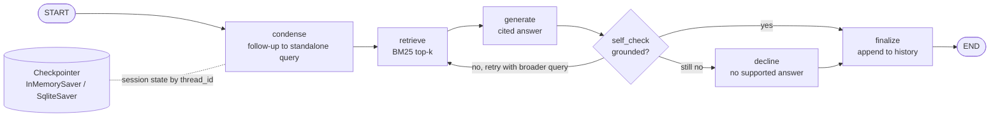

# Conversational RAG with Memory (LangGraph)

A multi-turn question-answering service built on **LangGraph** and **LangChain**. It keeps
per-session conversation memory, turns follow-up questions ("How long are *they*
retained?") into standalone search queries, checks every answer against the retrieved
context before returning it, and streams progress and tokens over server-sent events.

Project 03 of the [RAG Engineer Portfolio](../README.md).

## The problem this solves

Single-turn RAG breaks as soon as a user asks a follow-up:

> **User:** How often are ClickHouse backups taken?
> **User:** How long are they retained?

Searched on its own, the second question has no idea what "they" means, so it retrieves the
wrong thing or nothing. This service stores the conversation in a LangGraph checkpointer and
rewrites each follow-up into a standalone query before retrieval:

```
"How long are they retained?"  ->  "How long are they retained? clickhouse backups taken"
```

## Architecture



| Node | LLM mode (`OPENAI_API_KEY` set) | Heuristic mode (default, no key) |
|---|---|---|
| `condense` | LLM rewrites the question using recent history | Detects follow-ups (pronouns, "what about…", very short questions) and carries the conversation topic forward |
| `retrieve` | BM25 over paragraph chunks; the retry adds terms from recent turns | same |
| `generate` | `ChatOpenAI` answers from the context with `[source]` citations, streamed token by token | Extractive: best-matching sentences with citations |
| `self_check` | Grounding score: share of answer words found in the retrieved context, plus a relevance check | same |

**Memory** is LangGraph's checkpointer keyed by `thread_id` = `session_id`. The message
history (`add_messages` reducer) and the running topic persist between turns. Set
`MEMORY_BACKEND=sqlite` and sessions survive a server restart; a test proves it.

**Guardrail:** an answer that fails the grounding check is retried once with a broader
query. If it fails again, the user gets "I couldn't find that in the documents." instead
of an unsupported answer.

## Evaluation: what memory buys

`scripts/evaluate_memory.py` runs 6 conversations (18 turns) twice: once in a shared
session, and once with every turn sent to a fresh, empty session.

```
turn type   metric          no memory  with memory
first       source hit            83%          83%
first       answer hit           100%         100%
follow_up   source hit            83%         100%
follow_up   answer hit            83%         100%
```

*Source hit* = the expected document is the top-ranked source. *Answer hit* = the expected
fact (e.g. "14 days") is in the answer. First turns are identical by design; the gain is
entirely on follow-ups.

> Honest caveat: this is a small hand-written set over 5 short documents, and the heuristic
> mode was developed against it. Treat it as a regression check and a demonstration of the
> memory effect, not a benchmark. The heuristic is also lexical: it won't connect
> "not acknowledged" to "unacknowledged". The LLM mode handles those.

## Setup

```bash
cd conversational-rag-langgraph
pip install -r requirements.txt
uvicorn app.main:app --reload
```

LLM mode (optional):

```bash
pip install langchain-openai
export OPENAI_API_KEY=sk-...
```

## API

```bash
# multi-turn chat
curl -X POST localhost:8000/chat -H "content-type: application/json" \
  -d '{"session_id": "demo", "message": "How often are ClickHouse backups taken?"}'
curl -X POST localhost:8000/chat -H "content-type: application/json" \
  -d '{"session_id": "demo", "message": "How long are they retained?"}'
```

```json
{
  "answer": "ClickHouse backups are taken every 6 hours and retained for 14 days in encrypted object storage. [data_retention_policy.txt]",
  "standalone_query": "How long are they retained? clickhouse backups taken",
  "sources": ["data_retention_policy.txt"],
  "grounding": 1.0,
  "retrieval_attempts": 1
}
```

| Endpoint | Purpose |
|---|---|
| `POST /chat` | One turn; returns answer, standalone query, sources, grounding score |
| `POST /chat/stream` | Server-sent events: `step` per graph node, `token` while the answer is written, then `answer` |
| `GET /sessions/{id}/history` | Full conversation for a session |
| `DELETE /sessions/{id}` | Forget a session |
| `GET /health` | Mode (llm / heuristic) and memory backend |

## Tests

```bash
pytest -q   # 22 tests, no API key or network needed
```

The LLM code paths are tested offline with LangChain's `GenericFakeChatModel`:
- LLM condensing of follow-ups
- token streaming from the `generate` node
- a hallucinated answer that fails the grounding check, is retried, and is then declined

Other tests cover session isolation, SQLite persistence across a restart, out-of-domain
questions, and the streaming API.

## Configuration

| Variable | Default | Meaning |
|---|---|---|
| `MEMORY_BACKEND` | `memory` | `memory` or `sqlite` |
| `SQLITE_PATH` | `sessions.db` | SQLite file when using `sqlite` |
| `TOP_K` | `3` | Chunks retrieved per query |
| `HISTORY_TURNS` | `3` | Turns of history the condenser sees |
| `GROUNDING_THRESHOLD` | `0.6` | Minimum grounding score to accept an answer |
| `MAX_RETRIEVAL_ATTEMPTS` | `2` | Retrieval attempts before declining |
| `OPENAI_API_KEY` / `OPENAI_MODEL` | unset / `gpt-4o-mini` | Enables LLM mode |

## Docker

```bash
docker build -t conversational-rag .
docker run -p 8000:8000 -v rag-sessions:/data conversational-rag   # SQLite memory on a volume
```

## Design notes

- **Why BM25 here?** Project 01 covers dense + sparse fusion and reranking. This project is
  about conversation, and the graph only depends on `Retriever.search()`, so the project 01
  pipeline can be swapped in without touching the graph.
- **Why keep a heuristic mode?** It makes the whole service, its tests and CI run for free
  and deterministically, and gives a baseline to compare the LLM against.
